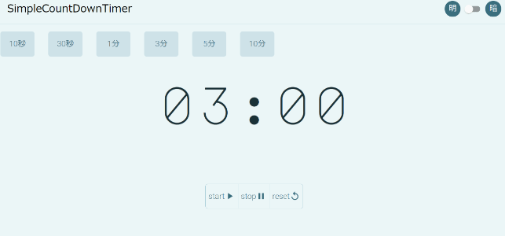

# nextjs_timer

Next.jsを使ったカウントダウンタイマーです。


## 使用している技術

## 使用方法

### 事前インストールが必要なもの

* [Node.js](https://nodejs.org/en/)
* [yarn](https://classic.yarnpkg.com/ja/)

#### Node.jsがインストールされているかの確認

Node.jsがインストールされているかは下記コマンドで確認できます。

```shell
# Node.jsのバージョン確認
node -v
```

```shell
v14.14.0
```

バージョンが返ってきたらインストール済みです。

#### yarnがインストールされているかの確認

yarnがインストールされているかは下記コマンドで確認できます。

```shell
yarn -v
```

```shell
1.22.5
```

バージョンが返ってきたらインストール済みです。

### クローン後のコマンド

リポジトリをクローン後、下記コマンドを実行してください。

```shell
yarn install
```

下記コマンドで開発用のサーバーが立ち上がります。

正常に動作することを確認してください。

```shell
yarn run dev
```

## 動作ページ

実際に動いているものはGithub Pagesで公開中です。

<https://sakelog.github.io/nextjs_timer/>



## 作成者

* 作成者:sake
* E-mail:sakelog.website@gmail.com
* Twitter:[@sake_engineer](https://twitter.com/sake_engineer)
* Webサイト:https://sake-log.website/